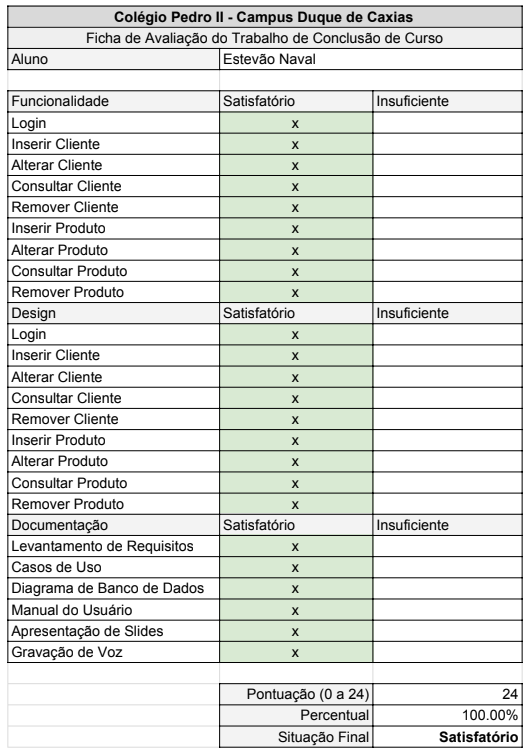

# Adega_da_Familia_Duarte

## Sobre
Este projeto é um sistema de comércio web online completo feito em HTML5, CSS3, JavaScript no front-end e PHP no back-end. A ideia principal se baseia em um sistema encomendado pela tradicional vendedora de vinhos chamada Adega da Família Duarte.

O projeto foi feito no âmbito de um trabalho de conclusão de curso do Colégio Pedro II, no caso, o ensino médio integrado ao curso de análise e desenvolvimento de sistemas da computação.

## Conclusão
É com grande orgulho e com grande alegria que eu anuncio a nota máxima neste trabalho. Foi um trabalho árduo, ainda mais sozinho, mas conseguimos, eu, Deus, que foi meu principal guia e pedra angular neste período tão complexo, bem como todos aqueles que me apoiaram. A todos estes que foram como escadas para a alçada do meu sucesso e cordas para a escalada de mais este desafio em minha vida, meu muito obrigado!

## App-Ideas

### Landing Page de Produto
Este projeto foi inspirado na ideia de uma landing page para um ou mais produtos do repositório App-Ideas do FlorinPop.

Whenever you have a product (or a service) that you want to sell, you'll want to have a website that will promote that product in the best way possible. You need to make sure that the information on the page is relevant, simple to understand and highlights all the awesome features of the product in order to higher the conversion rate.

Conversion rate - the % of the visitors which purchase the product or service.

When you have completed this app and the bonus features try leveling up your skills by expanding it to incorporate the features specified in the Simple Online Store.

**Link para o repositório da ideia:** [Landing Page de Produto](https://github.com/florinpop17/app-ideas/blob/master/Projects/1-Beginner/Product-Landing-Page.md)

#### Requisistos de usuário

These will cover the visual part of the project.

-   [X] ~User can see on the page one or more images with the product~
-   [X] ~User can see a list with all the features of the product~
-   [X] ~User can see how this product will improve the buyers life. Why should he buy it?~
-   [X] ~User can see a contact section (a text with the email)~

#### Implementações bônus

These will cover the functional part of the project.

-   [X] ~User can see a FAQ section~
-   [X] ~User can contact the staff members via a contact form~
-   [X] ~User can sign up to receive notifications about the product~
-   [ ] User can purchase the product

### Loja Online Simples
Este projeto também possui inspirações na ideia de um site de vendas online completo do repositório App-Ideas do FlorinPop.

In the Product Landing Page project you implemented a landing page to provide your users with information about a product and to hopefully increase your sites conversion rate.

The goal of the Simple Online Store is to give your users the capability of selecting a product to purchase, viewing purchase information, adding it to an online shopping cart, and finally, actually purchasing the products in the shopping cart.

**Link para o repositório da ideia:** [Loja Online Simples](https://github.com/florinpop17/app-ideas/blob/master/Projects/2-Intermediate/Simple-Online-Store.md)

#### Requisistos de usuário

-   [X] ~User can click on a `View Products` button on the Landing Page to 
display the Products Page.~
-   [X] ~User can see a card on the Products Page for each
Product showing the product thumbnail, name, price, a short description,
and a `Select` button.~
-   [x] ~User can see a Product Details page displayed when the `Select` button
is clicked showing the same information from the product card, but also a 
unique product id, a long description, `Add to Cart` button, and a 
`See More Products` button.~
-   [X] ~User can see a confirmation message when the product is added to the
shopping cart.~
-   [ ] User can click on the `See More Products` page to return to the 
Products Page. 
-   [ ] User can see a `Shopping Cart` button on both the Landing
Page or the Products Page. Hint:  a top bar might be a good common location
for this button.
-   [ ] User can click on the `Shopping Cart` button to display the Shopping
Cart page containing the product id, name, price, and quantity
ordered input box for each product previously added to the Shopping Cart.
-   [ ] User can see a total purchase amount on the Shopping Card that is
calculated as the sum of the quantities multiplied by the unit price for each
product ordered.
-   [ ] User can adjust the quantity ordered for any product to adjust the
total purchase amount. 
-   [ ] User can click a `Place Order` button on the Shopping Cart Page to 
complete the order. User will see a confirmation number when the order has been
placed.
-   [ ] User can click a `Cancel Order` button on the Shopping Cart Page to 
cancel the order. User will see the product quantities and the total purchase
amount reset to zero.
-   [ ] User can click a `See More Products` button on the Shopping Cart Page
to return to the Products Page. If the order hasn't been placed yet this will
not clear the products that have already been added to the Products Page.

#### Implementações bônus

-   [ ] User can see an error message if the quantity ordered exceeds the 
"on hand" quantity of the product.
-   [ ] User can specify a bill to and ship to address when the order is
placed from the Shopping Cart Page
-   [ ] User can see shipping charges added to the total purchase amount
-   [ ] User can see sales taxes added to the total purchase amount
-   [ ] Developer will implement the product inventory in an external file or
a database.

